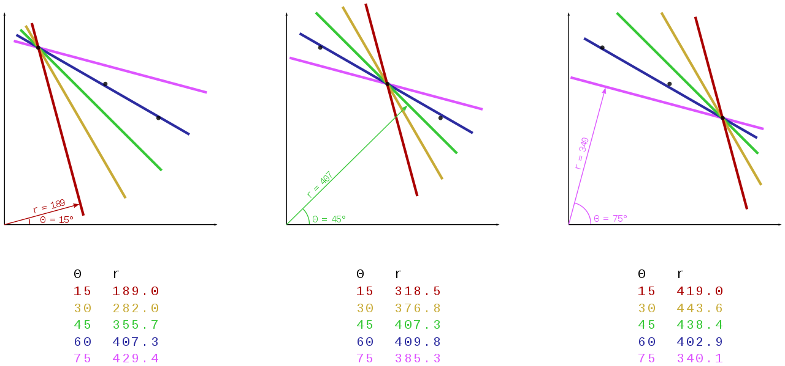
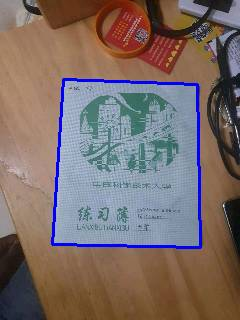

# Hough Transform: Document Detection

Hough Transform is a technique that locates shapes in images. In particular, it has been used to extract lines, circles, and ellipses. In our case, we will implement this technique to detect straight lines. Afterward, we will perform a document detection as an example use case for Hough Transform.

## Hough Line Transform

The Hough Line Transform is a transform used to detect straight lines. To apply the Transform, first, an edge detection pre-processing is desirable.

### Edge image

An edge image is the output of an edge detection algorithm. An edge detection algorithm detects the edge in an image by determining where the brightness of an image changes drastically. Examples of edge detection algorithms include Canny, Sobel, Laplacian, etc. For the Hough Transform algorithm, it is crucial to perform edge detection first to produce an edge image which will then be used as input into the algorithm.


### Alternate way to represent a line

In general, the straight line $y=mx$ can be represented as a point $(m, b)$. However, vertical lines pose a problem. They would give rise to unbound values of the slope $m$. Programmatically, this means that a computer would need an infinite amount of memory to represent all possible values of $m$. To avoid this issue, a straight line is represented by a line called the normal line that passes through the origin and is perpendicular to that straight line. The form of the normal line is $r=x\cos(\theta) + ysin(\theta)$ where $r$ is the length of the normal line and $\theta$ is the angle between the normal line and the $x$ axis.


### Line Detection

The line detection is based on a voting technique. Given a range of $\rho$ and $\theta$, for every edge pixel in the edge image vote up each potential line It is part of. The votes are old by an accumulator and at the end lines whose votes exceeded a certain threshold are returned.

### Example

Consider the three data points, shown here as black dots.



- For each data point, several lines are plotted to go through it, all at different angles. These are shown here in different colors.

- The Hough transform accumulates contributions from all pixels in the detected edge. To each line, a support line exists which is perpendicular to it and which intersects the origin. In each case, one of these is shown as an arrow.

- The length (i.e. perpendicular distance to the origin) and angle of each support line are calculated. Lengths and angles are tabulated below the diagrams.

From the calculations, it can be seen that in either case, the support line at 60° has a similar length. Hence, it is understood that the corresponding lines (the blue ones in the above picture) are very similar. One can thus assume that all points lie close to the blue line.

### Algorithm implementation

```python
def getLines(img, threshold, angle_step=1):
    """hough line using vectorized numpy operations,
    may take more memory, but takes much less time"""
    thetas = np.deg2rad(np.arange(-90.0, 90.0, angle_step))
    width, height = img.shape
    diag_len = int(np.ceil(np.sqrt(width * width + height * height)))   # max_dist
    rhos = np.linspace(-diag_len, diag_len, diag_len * 2)

    # Cache some resuable values
    cos_theta = np.cos(thetas)
    sin_theta = np.sin(thetas)
    num_thetas = len(thetas)

    # Hough accumulator array of theta vs rho
    accumulator = np.zeros((2 * diag_len, num_thetas))
    y_idxs, x_idxs = np.nonzero(img)  # (row, col) indexes to edges
    # Vote in the hough accumulator
    xcosthetas = np.dot(x_idxs.reshape((-1,1)), cos_theta.reshape((1,-1)))
    ysinthetas = np.dot(y_idxs.reshape((-1,1)), sin_theta.reshape((1,-1)))
    rhosmat = np.round(xcosthetas + ysinthetas) + diag_len
    rhosmat = rhosmat.astype(np.int16)
    for i in range(num_thetas):
        _rhos,counts = np.unique(rhosmat[:,i], return_counts=True)
        accumulator[_rhos,i] = counts
    # Thresholding
    idxs = np.argwhere(accumulator > threshold)
    rho_idxs, theta_idxs = idxs[:,0], idxs[:,1]
    return np.column_stack((rhos[rho_idxs], thetas[theta_idxs]))
```

## Document Detection

An example image of a document: 
[See Original image](images/1-Original%20Image.jpg)

### Pre-processing

1. Rescaling image

Processing high-resolution images are quite resource-intensive. Rescaling makes processing faster.


2. Morph functions

Corner detection will work best if we can omit unnecessary details in the image like the writings on the page. We can use morphological transformations - particularly a `Closing` which is a Dilation followed by Erosion - after converting the image to grayscale. A `Closing` operation is useful in closing small holes inside the foreground objects, or small black points on the object.


3. Filter noise to prevent false edge detection.

Noise can also affect edge detection, so it is essential to filter it out. Here we use `Gaussian Blur` to smooth the image.


4. Apply Canny edge detection to find the document edges

Now we can apply Canny edge detection to find the document edges.


### Hough lines

As said above, the Canny edge detection algorithm produced an edge image. We will use this image as an input for the Hough Line algorithm.


### Post-processing

1. Detect document quadrilateral

First, we need to get the lines' intersections. But as there are multiple lines and some of them are almost parallel to each other. To be more efficient, we need to filter out some intersections. In our implementation, we filter out intersections whose angles are not close to $90^\circ$.

We can combine the intersections into quadrilaterals. In the end we chose the quadrilateral with the largest area. 



2. Page Extraction

Given the document quadrilateral, We use Perspective Transform to extract the detected document. [See Transform on Original image](images/10-Original%20Transformed.jpg)


## References

[1] [https://docs.opencv.org/3.4/d9/db0/tutorial_hough_lines.html](https://docs.opencv.org/3.4/d9/db0/tutorial_hough_lines.html)

[2] [https://en.m.wikipedia.org/wiki/Hough_transform](https://en.m.wikipedia.org/wiki/Hough_transform)

[3] [https://docs.opencv.org/4.x/d9/d61/tutorial_py_morphological_ops.html](https://docs.opencv.org/4.x/d9/d61/tutorial_py_morphological_ops.html)

[4] [https://docs.opencv.org/4.x/da/d22/tutorial_py_canny.html](https://docs.opencv.org/4.x/da/d22/tutorial_py_canny.html)
